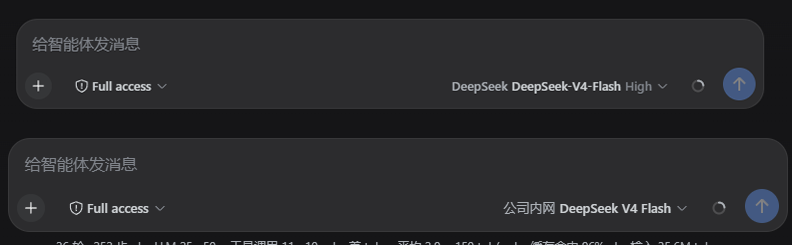

# dsh-model-provider-label

> ## ⚠️ Deprecated
>
> **This plugin is deprecated.** The "show provider name" feature has been
> merged into the new plugin **[dsh-chat-tweaks](https://github.com/haiyoucuv/dsh-chat-tweaks)**
> (a DSH UI-customization collection with a dedicated Settings page, more
> switches, and ongoing updates).
>
> - New plugin repository: <https://github.com/haiyoucuv/dsh-chat-tweaks>
> - Install the new plugin:
>
>   ```sh
>   dsh plugin --profile web add https://github.com/haiyoucuv/dsh-chat-tweaks/archive/refs/tags/v0.1.0.tar.gz
>   ```
>
> - After installing the new plugin, remove this one (both shadow the same UI
>   slot; coexistence throws):
>
>   ```sh
>   dsh plugin --profile web remove dsh-model-provider-label
>   ```
>
> The content below is kept for historical reference.

> Show the **provider display name** next to the model name in the DeepSeek
> Harness composer model seat, so identical model names from different
> providers become distinguishable.
>
> 在 DeepSeek Harness 对话框模型选择器同时显示 **provider 显示名** 与 **模型名**，
> 让不同 provider 下的同名模型一眼可辨。

[](https://github.com/haiyoucuv/dsh-model-provider-label/releases)
[](LICENSE)

[中文](README.md) | **English**

The stock model selector only shows the model name (e.g. `DeepSeek V4
Flash`). When you configure multiple providers that expose **identically
named models**, you cannot tell them apart. This plugin also shows the
provider's display name: **`DeepSeek · DeepSeek V4 Flash`**.

## Effect

| Default | With this plugin |
| ------- | ---------------- |
| `DeepSeek V4 Flash` | `DeepSeek · DeepSeek V4 Flash` |
| `GPT-5` (provider A) | `ProviderA · GPT-5` |
| `GPT-5` (provider B) | `ProviderB · GPT-5` |



The dropdown menu, reasoning-effort selection, model catalog loading and
error surfaces behave exactly like the stock implementation — this plugin
only **shadows** the `conversation.input.model` UI slot with a lower-priority
component and reuses the host's `modelDirectories` service for all data.

## Install

```sh
# From GitHub (recommended)
dsh plugin --profile web add https://github.com/haiyoucuv/dsh-model-provider-label/archive/refs/tags/v0.1.0.tar.gz

# Or from a local directory (development)
dsh plugin --profile web add link:/path/to/dsh-model-provider-label
```

**Restart `dsh web`** after installing so the browser client loads the
plugin bundle.

> Tip: you can also install it with pnpm directly in the profile directory:
>
> ```sh
> cd ~/.dsh/profiles/web && pnpm add https://github.com/haiyoucuv/dsh-model-provider-label/archive/refs/tags/v0.1.0.tar.gz
> ```

## Development

```sh
pnpm install          # installs esbuild / typescript dev deps
pnpm build            # builds lib/client.js (ModuleLoader format) + lib/index.js
```

- Source: `src/client/index.tsx` (apply / inject + slot shadowing),
  `src/client/ModelSelect.tsx` (the modified model selector)
- Styles: `src/client/ModelSelect.module.css`
- The built `lib/` output is committed, so installing does not require a
  local build

## How it works

DSH's `conversation.input.model` is a **single-kind UI slot**. It is
registered by the stock `dsh-client-ui-model-selection` plugin at
`priority: 0`. The slot system allows only one registration per priority
and lets a **lower priority shadow the default** (`lowest renders`). This
plugin registers the same slot at `priority: -100`, so our component is
rendered instead. The catalog data still comes from the host-injected
`modelDirectories` service (shared per session, same state as the `/model`
command), and translations reuse the host's `model` locale namespace
(not re-registered, to avoid a locale conflict).

## Customizing the display format

Edit the `providerLabel` / `modelLabel` / `triggerLabel` composition in
`src/client/ModelSelect.tsx`, then `pnpm build` and restart.

## License

MIT — see [LICENSE](LICENSE)